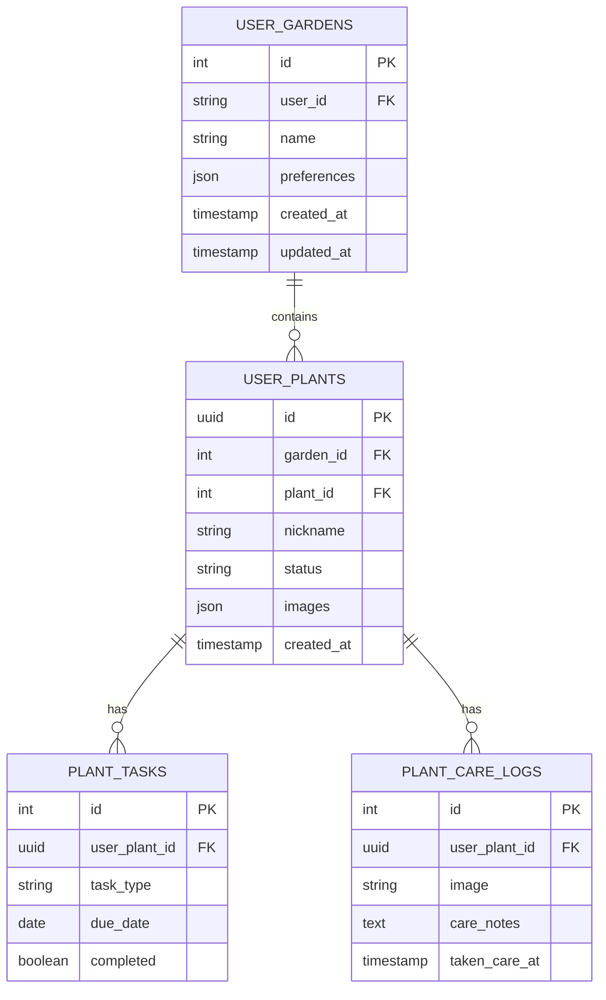

# 🏗️ GreenThumb App Architecture

> **Last Updated:** January 2025  
> **App Version:** 1.0.0  
> **Target Launch:** January 27, 2025

## 📋 Table of Contents

- [Overview](#overview)
- [Technical Stack](#technical-stack)
- [App Structure](#app-structure)
- [Data Architecture](#data-architecture)
- [Authentication Flow](#authentication-flow)
- [Navigation Structure](#navigation-structure)
- [State Management](#state-management)
- [Component Architecture](#component-architecture)
- [Service Layer](#service-layer)
- [Build & Deployment](#build--deployment)

## 🎯 Overview

GreenThumb is a React Native mobile application built with Expo that provides intelligent plant care management. The app follows a feature-based architecture with clear separation of concerns, TypeScript for type safety, and modern React patterns for optimal performance.

### Core Principles

1. **Type Safety First** - All code is strictly typed with TypeScript
2. **Feature-Based Organization** - Code organized by domain/feature rather than technical type
3. **Reactive Data Flow** - Unidirectional data flow with optimistic updates
4. **Offline-First** - Core features work without internet connectivity
5. **Performance Optimized** - Lazy loading, image caching, and efficient re-renders

## 🛠️ Technical Stack

### Frontend Framework

```
Expo SDK 53+
├── React Native 0.79.3
├── TypeScript 5.8+
├── Expo Router 5.0+ (File-based routing)
└── Metro Bundler (JavaScript bundling)
```

### UI & Styling

```
TailwindCSS 3.4+
├── NativeWind 4.1+ (React Native integration)
├── Expo Vector Icons 14.1+
└── Custom design system components
```

### State & Data Management

```
TanStack Query 5.68+
├── Jotai 2.12+ (Atomic state management)
├── React Context (Theme, Auth)
└── AsyncStorage (Offline persistence)
```

### Backend Services

```
Supabase
├── PostgreSQL Database
├── Real-time subscriptions
├── File storage
├── Row Level Security (RLS)
└── Edge Functions

Clerk Authentication
├── OAuth providers
├── User management
├── Session handling
└── Security policies
```

### Development Tools

```
EAS (Expo Application Services)
├── Build automation
├── OTA updates
├── Environment management
└── App store submission

Testing & Quality
├── Jest + Expo Testing Library
├── ESLint + Prettier
├── TypeScript compiler
└── Metro resolver
```

## 📁 App Structure

### File System Organization

```
GreenThumb-app/
│
├── app/                          # Expo Router app directory
│   ├── _layout.tsx              # Root layout with providers
│   ├── (auth)/                  # Authentication group
│   │   ├── _layout.tsx          # Auth layout
│   │   ├── welcome.tsx          # Welcome/onboarding
│   │   ├── sign-in.tsx          # Sign in screen
│   │   ├── sign-up.tsx          # Registration screen
│   │   └── oauth-native-callback.tsx
│   └── (home)/                  # Main app group (protected)
│       ├── _layout.tsx          # Tab navigator layout
│       ├── index.tsx            # Home dashboard
│       ├── calendar.tsx         # Task calendar
│       ├── profile.tsx          # User profile
│       ├── gardens/             # Garden management
│       │   ├── index.tsx        # Gardens list
│       │   ├── create.tsx       # Create garden
│       │   └── [id]/            # Dynamic garden routes
│       └── plants/              # Plant management
│           ├── index.tsx        # Plants list
│           ├── add.tsx          # Add plant
│           └── [id]/            # Dynamic plant routes
│
├── components/                   # Reusable UI components
│   ├── UI/                      # Base UI components
│   │   ├── Button.tsx
│   │   ├── Input.tsx
│   │   ├── LoadingSpinner.tsx
│   │   ├── PageContainer.tsx
│   │   └── Text.tsx
│   ├── Auth/                    # Authentication components
│   ├── Home/                    # Home screen components
│   ├── Gardens/                 # Garden-specific components
│   ├── Database/                # Data management components
│   └── icons/                   # Custom icon components
│
├── lib/                         # Core application logic
│   ├── queries.ts               # TanStack Query hooks
│   ├── supabaseApi.ts           # Database operations
│   ├── supabaseClient.ts        # Supabase configuration
│   ├── storage.ts               # AsyncStorage utilities
│   ├── gardenHelpers.ts         # Garden-specific utilities
│   ├── hooks/                   # Custom React hooks
│   ├── services/                # External service integrations
│   └── query/                   # Query-specific utilities
│
├── types/                       # TypeScript type definitions
│   ├── garden.ts                # Garden & plant types
│   ├── supabase.ts              # Database schema types
│   ├── plant.ts                 # Plant data types
│   └── weather.ts               # Weather API types
│
├── constants/                   # App constants
├── atoms/                       # Jotai atom definitions
├── assets/                      # Static assets
└── utils/                       # Utility functions
```

## 🗄️ Data Architecture

### Database Schema Overview



### Data Flow Pattern

```
User Action → Component → Query Hook → Supabase API → Database
     ↓              ↓           ↓            ↓           ↓
UI Update ← Optimistic ← Cache ← Response ← Database
           Update     Update
```

### Query Strategy

- **TanStack Query** for server state management
- **Optimistic updates** for immediate UI feedback
- **Background refetching** for data freshness
- **Offline caching** with AsyncStorage persistence
- **Real-time subscriptions** for collaborative features

## 🔐 Authentication Flow

### Architecture Pattern

```
App Launch → Clerk Session Check → Supabase Token Sync → User State
     ↓                ↓                    ↓               ↓
Route Guard ← Auth Context ← Session Hook ← User Data
```

### Implementation Details

1. **Clerk Integration**

   - OAuth providers (Google, Apple, Email)
   - Secure session management
   - Automatic token refresh
   - User profile management

2. **Supabase Synchronization**

   - Custom hook `useSupabaseAuth()`
   - Automatic JWT token sharing
   - User profile creation/sync
   - Row Level Security (RLS) enforcement

3. **Route Protection**
   - Expo Router groups for auth/protected routes
   - Automatic redirects based on auth state
   - Persistent session across app restarts

## 🧭 Navigation Structure

### Route Architecture

```
App Root
├── (auth) Group - Public routes
│   ├── welcome - Onboarding
│   ├── sign-in - Authentication
│   └── sign-up - Registration
│
└── (home) Group - Protected routes
    ├── Tab Navigator
    │   ├── index (Home) - Dashboard
    │   ├── calendar - Task management
    │   └── profile - User settings
    │
    └── Stack Routes
        ├── gardens/* - Garden management
        └── plants/* - Plant management
```

### Navigation Patterns

- **File-based routing** with Expo Router
- **Nested navigators** for complex flows
- **Dynamic routes** for entity-specific screens
- **Deep linking** support for sharing
- **Back button handling** for Android

## 🔄 State Management

### Architecture Layers

```
Global State (Jotai Atoms)
├── User preferences
├── Theme settings
└── Offline data sync

Server State (TanStack Query)
├── Garden data
├── Plant information
├── Task schedules
└── Care logs

Local State (React State)
├── Form inputs
├── UI animations
├── Modal visibility
└── Temporary data
```

### State Patterns

1. **Atomic State Design**

   - Small, focused atoms
   - Derived state calculations
   - Selective subscriptions
   - Minimal re-renders

2. **Query State Management**

   - Normalized cache keys
   - Optimistic mutations
   - Background updates
   - Error boundaries

3. **Form State Handling**
   - Controlled components
   - Validation with Zod
   - Optimistic UI feedback
   - Error state management

## 🧩 Component Architecture

### Design System Hierarchy

```
Design System
├── Tokens (colors, spacing, typography)
├── Base Components (Button, Input, Text)
├── Composite Components (Card, Modal, List)
├── Feature Components (TaskList, GardenCard)
└── Screen Components (Home, Gardens, Plants)
```

### Component Patterns

1. **Composition over Inheritance**

   - Compound components
   - Render props pattern
   - Custom hooks for logic
   - Flexible prop interfaces

2. **Performance Optimization**

   - React.memo for expensive renders
   - useCallback/useMemo for stability
   - Lazy loading for heavy components
   - Image optimization with Expo Image

3. **Accessibility First**
   - Screen reader support
   - Keyboard navigation
   - Color contrast compliance
   - Focus management

### Component Structure Example

```typescript
// Feature Component Pattern
export function TaskList({ tasks, onComplete, loading }: TaskListProps) {
  return (
    <PageContainer>
      <TaskHeader count={tasks.length} />
      <TaskItems tasks={tasks} onComplete={onComplete} loading={loading} />
    </PageContainer>
  );
}

// Compound Component Pattern
TaskList.Header = TaskHeader;
TaskList.Items = TaskItems;
TaskList.Item = TaskItem;
```

## 🔧 Service Layer

### Architecture Pattern

```
Components → Custom Hooks → Service Layer → External APIs
     ↓            ↓             ↓              ↓
  UI Logic → Business → Data Access → Network
            Logic      Layer        Requests
```

### Service Implementation

1. **Supabase Service**

   ```typescript
   // lib/supabaseApi.ts
   export const gardenService = {
     create: (garden: CreateGardenInput) => Promise<Garden>,
     update: (id: number, updates: UpdateGardenInput) => Promise<Garden>,
     delete: (id: number) => Promise<void>,
     list: (userId: string) => Promise<Garden[]>,
   };
   ```

2. **Query Hooks**

   ```typescript
   // lib/queries.ts
   export function useGardens(userId?: string) {
     return useQuery({
       queryKey: ["gardens", userId],
       queryFn: () => gardenService.list(userId!),
       enabled: !!userId,
       staleTime: 5 * 60 * 1000, // 5 minutes
     });
   }
   ```

3. **Mutation Patterns**

   ```typescript
   export function useCreateGarden() {
     const queryClient = useQueryClient();

     return useMutation({
       mutationFn: gardenService.create,
       onSuccess: () => {
         queryClient.invalidateQueries(["gardens"]);
       },
       onMutate: async (newGarden) => {
         // Optimistic update logic
       },
     });
   }
   ```

## 📱 Build & Deployment

### EAS Configuration

```json
// eas.json
{
  "build": {
    "development": {
      "developmentClient": true,
      "distribution": "internal"
    },
    "preview": {
      "distribution": "internal",
      "ios": { "resourceClass": "m-medium" }
    },
    "production": {
      "autoIncrement": true,
      "ios": { "resourceClass": "m-medium" }
    }
  }
}
```

### Deployment Strategy

1. **Development Builds**

   - Development client for testing
   - Internal distribution
   - Instant updates with Metro

2. **Preview Builds**

   - Staging environment testing
   - TestFlight/Internal testing
   - Production-like environment

3. **Production Builds**
   - App Store ready builds
   - Automatic version incrementing
   - Release management

### Environment Management

```typescript
// Environment Variables
EXPO_PUBLIC_CLERK_PUBLISHABLE_KEY; // Client-side auth
EXPO_PUBLIC_SUPABASE_URL; // Database URL
EXPO_PUBLIC_SUPABASE_ANON_KEY; // Database public key
EXPO_PUBLIC_OPENWEATHER_API_KEY; // Weather integration

// Build-time Variables
EAS_PROJECT_ID; // EAS project identifier
```

## 🔍 Performance Considerations

### Optimization Strategies

1. **Bundle Size**

   - Tree shaking unused code
   - Lazy loading screens
   - Optimized image assets
   - Minimal third-party dependencies

2. **Runtime Performance**

   - Memoized expensive calculations
   - Virtualized lists for large datasets
   - Image caching and optimization
   - Background task processing

3. **Memory Management**
   - Proper cleanup in useEffect
   - Avoiding memory leaks in listeners
   - Efficient query cache management
   - Image memory optimization

### Monitoring & Analytics

- **Performance Monitoring**: React Native Performance
- **Error Tracking**: Sentry (to be implemented)
- **User Analytics**: Custom analytics (to be implemented)
- **Crash Reporting**: Expo built-in reporting

## 🧪 Testing Strategy

### Testing Pyramid

```
E2E Tests (Detox/Maestro)
├── Critical user journeys
├── Cross-platform compatibility
└── Performance testing

Integration Tests (React Native Testing Library)
├── Component interactions
├── Data flow testing
└── Navigation testing

Unit Tests (Jest)
├── Utility functions
├── Custom hooks
├── Business logic
└── API services
```

### Test Organization

```
__tests__/
├── components/     # Component tests
├── hooks/          # Custom hook tests
├── services/       # Service layer tests
├── utils/          # Utility function tests
└── e2e/            # End-to-end tests
```

## 🚀 Launch Readiness

### Pre-Launch Checklist

- [x] **Core Features Complete** - All major functionality implemented
- [x] **Authentication Flow** - Secure user management
- [x] **Data Architecture** - Scalable database design
- [x] **Performance Optimized** - Smooth user experience
- [ ] **Animation Bugs Fixed** - Resolve useNativeDriver warnings
- [ ] **App Store Assets** - Screenshots, metadata, descriptions
- [ ] **Testing Complete** - Beta testing and QA
- [ ] **Documentation** - Complete technical documentation

### Post-Launch Roadmap

1. **Performance Monitoring** - Set up analytics and crash reporting
2. **Feature Enhancement** - Weather integration, plant identification
3. **Premium Features** - Subscription model implementation
4. **Platform Expansion** - Web version, tablet optimization
5. **AI Integration** - Advanced care recommendations

---

**📅 Last Updated:** January 2025  
**🎯 Launch Target:** January 27, 2025  
**📱 Platforms:** iOS App Store & Google Play Store
