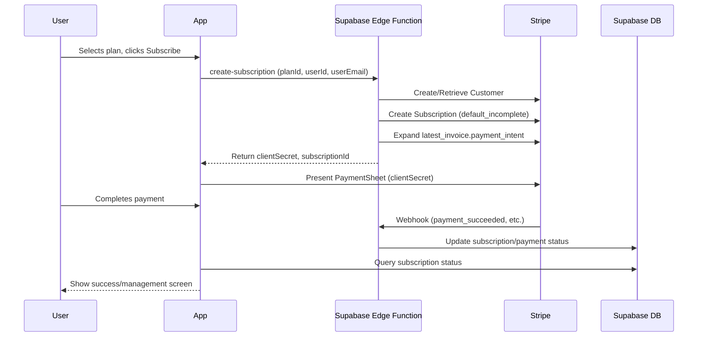

# 🚀 Stripe Subscription Checkout Architecture (2025+)

## Overview

GreenThumb now uses a **mobile-first, secure, and efficient subscription checkout flow** powered by Supabase Edge Functions and Stripe. All payment and subscription logic is handled by Edge Functions—no `/api` routes, no server code in the app, and no Stripe secrets exposed to the client.

## How It Works

1. **User selects a plan in the app.**
2. **App calls a Supabase Edge Function (`create-subscription`)** with `{ planId, userId, userEmail }`.
3. **Edge Function:**
   - Finds or creates a Stripe Customer for the user.
   - Creates a Stripe Subscription with `payment_behavior: default_incomplete` and expands `latest_invoice.payment_intent`.
   - Returns the PaymentIntent `client_secret` and subscription ID to the app.
4. **App presents the Stripe PaymentSheet** using the returned `client_secret`.
5. **User completes payment.**
6. **Stripe triggers webhooks** (e.g., `invoice.payment_succeeded`, `customer.subscription.created`).
7. **A Supabase Edge Function webhook** updates the database (`user_subscriptions`, `payment_history`, etc.) to reflect the latest Stripe state.
8. **App queries Supabase** for up-to-date subscription status.

## Why This Is Best

- **No SetupIntent/Ephemeral Key required** for simple subscription checkout (unless you want in-app payment method management UI).
- **All secrets and business logic** are in Edge Functions, not the app.
- **Minimal roundtrips:** Only one backend call before payment.
- **Stripe’s recommended approach** for mobile subscriptions.
- **Easy to extend** (add Apple Pay, manage cards, etc. later).

## Sequence Diagram



## Optional: Payment Method Management

- If you want to let users manage their saved cards (add/remove), add an Edge Function to create an Ephemeral Key and UI for that. For most subscription apps, the above is the fastest, most secure, and Stripe-recommended flow.

---

# 🔄 Subscription Integration Guide

## Overview

The subscription system has been strategically integrated **without disrupting** the existing auth and onboarding flow. All subscription prompts are additive and context-aware.

## Integration Points

### 1. **Post-Signup Welcome (Non-Disruptive)**

- **Location**: Home screen (`app/(tabs)/index.tsx`)
- **Trigger**: New users (< 7 days old) with minimal usage
- **Behavior**: Gentle welcome banner that introduces premium features
- **User Control**: Easily dismissible, never blocks functionality

```tsx
// Shows only for new users in their first week
{
  showWelcomeBanner && (
    <WelcomeSubscriptionBanner
      onDismiss={() => setShowWelcomeBanner(false)}
      showUpgrade={usageSummary.gardens.current > 0}
    />
  );
}
```

### 2. **Smart Contextual Prompts**

- **Location**: Throughout the app via `<SmartSubscriptionPrompt />`
- **Behavior**: Context-aware prompts based on user behavior
- **Intelligence**:
  - Max 1 prompt per 24 hours
  - Max 3 of same type ever
  - Only shows at natural moments
  - Never blocks functionality

### 3. **Usage Limit Enforcement**

- **Location**: Feature entry points (garden creation, task completion, etc.)
- **Behavior**: Soft limits with progressive disclosure
- **User Experience**:
  - 50% usage → subtle banner
  - 70% usage → warning banner
  - 100% usage → paywall (with bypass options)

### 4. **Strategic Trigger System**

The system tracks user behavior and shows subscription prompts at optimal moments:

```tsx
// Example: After user creates their first garden
await subscriptionTriggers.trackEngagement("garden_created");

// Example: When approaching limits
const trigger = await subscriptionTriggers.getCurrentTrigger();
if (trigger) {
  // Show contextual upgrade prompt
}
```

## Auth Flow Preservation

### ✅ **What Stays the Same**

- Welcome screen (`app/(auth)/welcome.tsx`) - **Unchanged**
- Sign-in flow (`app/(auth)/sign-in.tsx`) - **Unchanged**
- Sign-up flow (`app/(auth)/sign-up.tsx`) - **Unchanged**
- OAuth flow (`app/(auth)/oauth-native-callback.tsx`) - **Unchanged**
- Layout and navigation - **Unchanged**

### ✅ **What's Added (Non-Disruptive)**

- Post-signup welcome banner (dismissible)
- Smart subscription prompts (context-aware)
- Usage tracking and limits
- Paywall components (only when limits reached)

## User Journey

### **New User Experience**

1. **Welcome Screen** → Sign Up → **Existing Flow** ✅
2. **Home Screen** → Gentle welcome banner (dismissible)
3. **Natural Usage** → Smart prompts at optimal moments
4. **Limit Approach** → Progressive warnings
5. **Limit Reached** → Paywall with clear benefits

### **Returning User Experience**

1. **Sign In** → **Existing Flow** ✅
2. **Home Screen** → Smart prompts (max 1/day)
3. **Feature Usage** → Soft limits with contextual prompts
4. **Upgrade Moments** → Strategic feature discovery

## Prompt Strategy

### **Timing Rules**

- **New Users**: Welcome after first successful action
- **Active Users**: After 5+ meaningful actions
- **Limit Approaching**: At 70% of usage
- **Feature Discovery**: After successful use of related features

### **Frequency Limits**

- Max 1 subscription prompt per 24 hours
- Max 3 of same prompt type ever
- Smart cooldown periods based on user response

### **User Control**

- All prompts are dismissible
- "Not interested" option always available
- Never blocks core functionality
- Clear upgrade path when user is ready

## Components Overview

### **Core Components**

1. **`WelcomeSubscriptionBanner`** - Gentle introduction for new users
2. **`SmartSubscriptionPrompt`** - Context-aware prompts
3. **`PaywallPrompt`** - Feature-specific upgrade prompts
4. **`SubscriptionGate`** - Usage limit enforcement

### **Hooks & Logic**

1. **`useSubscriptionTriggers`** - Behavioral tracking and prompt logic
2. **`useUsageLimits`** - Usage tracking and enforcement
3. **`useSmartSubscriptionPrompt`** - Programmatic prompt control

### **Database Integration**

- **`user_usage`** table tracks consumption
- **`subscriptions`** table manages premium status
- **Stored procedures** handle usage increments
- **RLS policies** ensure data security

## Technical Implementation

### **Usage Limits (Freemium Model)**

```typescript
const FREE_LIMITS = {
  gardens: 2,
  plants_per_garden: 5,
  tasks_per_month: 25,
  photo_uploads_per_month: 10,
  ai_suggestions_per_month: 5,
};

const PREMIUM_LIMITS = {
  // All unlimited
};
```

### **Subscription Gates**

```tsx
<SubscriptionGate
  feature="gardens"
  action="create"
  onUpgrade={() => router.push("/subscription/pricing")}
>
  <CreateGardenForm />
</SubscriptionGate>
```

### **Smart Prompts**

```tsx
// Automatic detection
<SmartSubscriptionPrompt />;

// Manual trigger
const { triggerAfterAction } = useSmartSubscriptionPrompt();
await triggerAfterAction("garden_created");
```

## Key Benefits

### **For Users**

- ✅ Uninterrupted onboarding experience
- ✅ Generous free tier (2 gardens, 5 plants each)
- ✅ Clear value proposition at natural moments
- ✅ Never blocked from basic functionality
- ✅ Progressive disclosure of premium features

### **For Business**

- ✅ Non-intrusive revenue prompts
- ✅ Behavioral targeting for higher conversion
- ✅ Multiple touchpoints for subscription
- ✅ Data-driven prompt optimization
- ✅ Freemium model with clear upgrade path

## Testing & Validation

### **Test Scenarios**

1. **New User Journey**: Complete onboarding → See welcome banner
2. **Usage Progression**: Create gardens → Approach limits → See prompts
3. **Prompt Frequency**: Dismiss prompts → Verify cooldown periods
4. **Premium Upgrade**: Subscribe → Verify prompts disappear
5. **Feature Gates**: Hit limits → See paywalls → Verify bypass options

### **Key Metrics to Track**

- Welcome banner interaction rate
- Prompt-to-upgrade conversion rate
- Feature gate bypass vs. upgrade rate
- Premium feature adoption post-upgrade
- User satisfaction (support tickets, reviews)

## Future Enhancements

### **Potential Additions**

1. **Trial Periods**: 7-day premium trial for engaged users
2. **Seasonal Promotions**: Context-aware discount offers
3. **Referral Rewards**: Premium features for successful referrals
4. **Achievement Unlocks**: Premium features as milestone rewards
5. **A/B Testing**: Optimize prompt timing and messaging

### **Analytics Integration**

- Track conversion funnels
- Monitor prompt effectiveness
- Measure feature adoption
- Analyze churn points
- Optimize pricing strategy

---

## Summary

The subscription system is now **fully integrated** without disrupting your excellent auth flow. Users get a **generous free experience** with **strategic, non-intrusive prompts** that appear at natural moments when they're most likely to see value in upgrading.

**Your auth flow remains exactly as it was** - this is purely additive functionality that respects your existing user experience while creating clear revenue opportunities.
