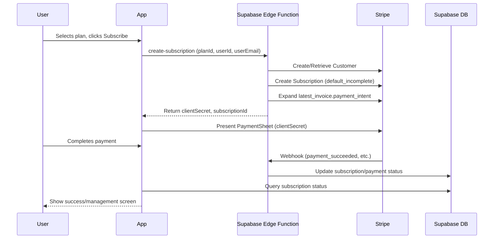

# 🔧 GreenThumb Technical Implementation Guide

> **Version:** 2.0 (Updated January 2025)  
> **Last Updated:** January 14, 2025  
> **Expo SDK:** 53  
> **React Native:** 0.74+  
> **TypeScript:** 5.0+

---

## 🚨 Important: User Feedback Integration

**Critical Issues Identified:** User interviews (January 14, 2025) revealed several critical bugs and UX issues that must be addressed before launch. See detailed analysis in:

- **Task Tracking:** `notes/TASK.md` → "USER INTERVIEW FINDINGS" section
- **Detailed Analysis:** `docs/user_feedback.md` → Complete interview analysis and recommendations

**Priority Issues for Development Team:**

1. 🔴 **Database scrolling non-functional** - Core feature broken
2. 🔴 **Database filters not working** - Filter modal errors
3. 🔴 **Garden completion status mismatch** - Data integrity issue
4. 🟡 **Typography inconsistency** - Brand guidelines violation
5. 🟡 **Layout bugs with long text** - UI responsiveness issues

**Action Required:** Review user feedback documentation before implementing any new features or making architectural changes.

---

## 📋 Table of Contents

1. [Development Environment](#development-environment)
2. [Authentication Implementation](#authentication-implementation)
3. [Database Integration](#database-integration)
4. [Subscription System](#subscription-system)
5. [UI Components & Styling](#ui-components--styling)
6. [Location Input & Geocoding](#location-input--geocoding)
7. [Navigation & Routing](#navigation--routing)
8. [Navigation Context Management](#navigation-context-management)
9. [State Management](#state-management)
10. [Performance Optimization](#performance-optimization)
11. [Testing Strategy](#testing-strategy)
12. [Deployment & CI/CD](#deployment--cicd)

---

## 🛠️ Development Environment

### Prerequisites

```bash
# Required tools
node >= 18.0.0
npm >= 9.0.0
expo-cli >= 6.0.0
eas-cli >= 5.0.0

# Development tools
git
vscode (recommended)
android-studio (for Android development)
xcode (for iOS development, macOS only)
```

### Project Setup

```bash
# Clone repository
git clone https://github.com/your-org/greenthumb-app.git
cd greenthumb-app

# Install dependencies
npm install

# Set up environment variables
cp .env.example .env
# Edit .env with your actual values

# Start development server
npx expo start

# Run on specific platform
npx expo start --ios
npx expo start --android
```

### Environment Variables

```bash
# .env file structure
EXPO_PUBLIC_SUPABASE_URL=your_supabase_url
EXPO_PUBLIC_SUPABASE_ANON_KEY=your_supabase_anon_key
SUPABASE_SERVICE_ROLE_KEY=your_service_role_key

# Stripe Configuration (NEW - January 2025)
EXPO_PUBLIC_STRIPE_PUBLISHABLE_KEY=pk_test_...
STRIPE_SECRET_KEY=sk_test_...
STRIPE_WEBHOOK_SECRET=whsec_...

# Optional services
SENTRY_DSN=your_sentry_dsn
ANALYTICS_API_KEY=your_analytics_key
```

---

## 🔐 Authentication Implementation

**IMPORTANT:** This project uses **Clerk** for authentication, not Supabase Auth. The examples below are for reference only.

### Clerk + Supabase Integration

This project uses Clerk for authentication with Supabase as the database backend. Key integration points:

#### User ID Handling

- **Clerk User IDs:** TEXT strings like `user_2tj0mC9c8UaPRPo77HUDAQ9ZEs5`
- **Database Schema:** All `user_id` columns must be `TEXT NOT NULL`, never `UUID`
- **RLS Policies:** Always use `requesting_user_id()` function, never `auth.uid()`

#### Critical Function: `requesting_user_id()`

```sql
-- This function extracts Clerk user ID from JWT claims
CREATE OR REPLACE FUNCTION requesting_user_id()
RETURNS TEXT AS $$
  SELECT NULLIF(
    current_setting('request.jwt.claims', true)::json->>'sub',
    ''
  )::text;
$$ LANGUAGE sql STABLE;
```

#### RLS Policy Pattern

```sql
-- ✅ CORRECT - Use requesting_user_id() for Clerk integration
CREATE POLICY "Users can view their own data" ON table_name FOR
SELECT USING (requesting_user_id() = user_id);

-- ❌ WRONG - Never use auth.uid() with Clerk
CREATE POLICY "Users can view their own data" ON table_name FOR
SELECT USING (auth.uid()::text = user_id);
```

#### Common Error Prevention

If you see errors like `"invalid input syntax for type uuid: \"user_2tj0mC9c8UaPRPo77HUDAQ9ZEs5\""`, it means:

1. A table has `user_id UUID` instead of `user_id TEXT`
2. An RLS policy is using `auth.uid()` instead of `requesting_user_id()`
3. The `requesting_user_id()` function is missing from the database

### Legacy Supabase Auth Setup (For Reference Only)

```typescript
// lib/supabase.ts
import { createClient } from "@supabase/supabase-js";
import AsyncStorage from "@react-native-async-storage/async-storage";

const supabaseUrl = process.env.EXPO_PUBLIC_SUPABASE_URL!;
const supabaseAnonKey = process.env.EXPO_PUBLIC_SUPABASE_ANON_KEY!;

export const supabase = createClient(supabaseUrl, supabaseAnonKey, {
  auth: {
    storage: AsyncStorage,
    autoRefreshToken: true,
    persistSession: true,
    detectSessionInUrl: false,
  },
});
```

### Auth Context Implementation

```typescript
// contexts/AuthContext.tsx
import { createContext, useContext, useEffect, useState } from "react";
import { Session, User } from "@supabase/supabase-js";
import { supabase } from "@/lib/supabase";

interface AuthContextType {
  user: User | null;
  session: Session | null;
  loading: boolean;
  signIn: (email: string, password: string) => Promise<void>;
  signUp: (email: string, password: string) => Promise<void>;
  signOut: () => Promise<void>;
}

const AuthContext = createContext<AuthContextType | undefined>(undefined);

export const AuthProvider = ({ children }: { children: React.ReactNode }) => {
  const [user, setUser] = useState<User | null>(null);
  const [session, setSession] = useState<Session | null>(null);
  const [loading, setLoading] = useState(true);

  useEffect(() => {
    // Get initial session
    supabase.auth.getSession().then(({ data: { session } }) => {
      setSession(session);
      setUser(session?.user ?? null);
      setLoading(false);
    });

    // Listen for auth changes
    const {
      data: { subscription },
    } = supabase.auth.onAuthStateChange(async (event, session) => {
      setSession(session);
      setUser(session?.user ?? null);
      setLoading(false);
    });

    return () => subscription.unsubscribe();
  }, []);

  const signIn = async (email: string, password: string) => {
    const { error } = await supabase.auth.signInWithPassword({
      email,
      password,
    });
    if (error) throw error;
  };

  const signUp = async (email: string, password: string) => {
    const { error } = await supabase.auth.signUp({
      email,
      password,
    });
    if (error) throw error;
  };

  const signOut = async () => {
    const { error } = await supabase.auth.signOut();
    if (error) throw error;
  };

  return (
    <AuthContext.Provider
      value={{
        user,
        session,
        loading,
        signIn,
        signUp,
        signOut,
      }}
    >
      {children}
    </AuthContext.Provider>
  );
};

export const useAuth = () => {
  const context = useContext(AuthContext);
  if (context === undefined) {
    throw new Error("useAuth must be used within an AuthProvider");
  }
  return context;
};
```

---

## 🗄️ Database Integration

### Supabase Client Queries

```typescript
// lib/queries/plants.ts
import { supabase } from "@/lib/supabase";
import { Plant, CreatePlantData } from "@/types/plants";

export const plantQueries = {
  // Get all plants for a garden
  getPlantsByGarden: async (gardenId: string): Promise<Plant[]> => {
    const { data, error } = await supabase
      .from("plants")
      .select(
        `
        *,
        plant_care_logs (
          id,
          care_type,
          notes,
          created_at
        )
      `
      )
      .eq("garden_id", gardenId)
      .order("created_at", { ascending: false });

    if (error) throw error;
    return data || [];
  },

  // Create new plant
  createPlant: async (plantData: CreatePlantData): Promise<Plant> => {
    const { data, error } = await supabase
      .from("plants")
      .insert(plantData)
      .select()
      .single();

    if (error) throw error;
    return data;
  },

  // Update plant
  updatePlant: async (id: string, updates: Partial<Plant>): Promise<Plant> => {
    const { data, error } = await supabase
      .from("plants")
      .update(updates)
      .eq("id", id)
      .select()
      .single();

    if (error) throw error;
    return data;
  },

  // Delete plant
  deletePlant: async (id: string): Promise<void> => {
    const { error } = await supabase.from("plants").delete().eq("id", id);

    if (error) throw error;
  },
};
```

### React Query Integration

```typescript
// lib/queries/useQueries.ts
import { useQuery, useMutation, useQueryClient } from "@tanstack/react-query";
import { plantQueries } from "./plants";

export const usePlants = (gardenId: string) => {
  return useQuery({
    queryKey: ["plants", gardenId],
    queryFn: () => plantQueries.getPlantsByGarden(gardenId),
    enabled: !!gardenId,
  });
};

export const useCreatePlant = () => {
  const queryClient = useQueryClient();

  return useMutation({
    mutationFn: plantQueries.createPlant,
    onSuccess: (newPlant) => {
      // Invalidate and refetch plants query
      queryClient.invalidateQueries({
        queryKey: ["plants", newPlant.garden_id],
      });

      // Optimistically update the cache
      queryClient.setQueryData(
        ["plants", newPlant.garden_id],
        (old: Plant[] = []) => {
          return [newPlant, ...old];
        }
      );
    },
  });
};
```

### Denormalized Garden Data Sync: user_gardens_flat

**Overview:**

- The `user_gardens_flat` table is a denormalized, always-fresh representation of all user garden data, replacing the old `user_gardens_full_data` materialized view.
- This table is kept in sync using PostgreSQL trigger functions.

**Trigger Functions:**

- `trg_upsert_garden_flat`: Upserts a row in `user_gardens_flat` on every `INSERT` or `UPDATE` to `user_gardens`. It resolves lookup values (e.g., maintenance, texture, available space, sunlight, soil texture) and writes them as flat fields.
- `trg_delete_garden_flat`: Deletes the corresponding row from `user_gardens_flat` on `DELETE` from `user_gardens`.

**Events:**

- Triggers are attached to `user_gardens` for `INSERT`, `UPDATE`, and `DELETE` events.
- All changes to user garden data are immediately reflected in the denormalized table.

**Materialized View Removal:**

- The old `user_gardens_full_data` materialized view has been dropped. All code now reads from `user_gardens_flat`.

**Benefits:**

- No more global refreshes or stale data.
- Fast, per-user reads and updates.
- Simplified frontend/backend data access.
- Easy to extend with new fields as needed.

---

## 💳 Stripe Subscription Integration (2025+)

GreenThumb now uses a **Supabase Edge Function-based Stripe integration** for all subscription and payment flows. All Stripe API calls (customer, subscription, payment, webhook) are handled by Edge Functions—no `/api` routes, no server code in the app, and no Stripe secrets exposed to the client.

### How It Works

1. **User selects a plan in the app.**
2. **App calls a Supabase Edge Function (`create-subscription`)** with `{ planId, userId, userEmail }`.
3. **Edge Function:**
   - Finds or creates a Stripe Customer for the user.
   - Creates a Stripe Subscription with `payment_behavior: default_incomplete` and expands `latest_invoice.payment_intent`.
   - Returns the PaymentIntent `client_secret` and subscription ID to the app.
4. **App presents the Stripe PaymentSheet** using the returned `client_secret`.
5. **User completes payment.**
6. **Stripe triggers webhooks** (e.g., `invoice.payment_succeeded`, `customer.subscription.created`).
7. **A Supabase Edge Function webhook** updates the database (`user_subscriptions`, `payment_history`, etc.) to reflect the latest Stripe state.
8. **App queries Supabase** for up-to-date subscription status.

### Why This Is Best

- **No SetupIntent/Ephemeral Key required** for simple subscription checkout (unless you want in-app payment method management UI).
- **All secrets and business logic** are in Edge Functions, not the app.
- **Minimal roundtrips:** Only one backend call before payment.
- **Stripe’s recommended approach** for mobile subscriptions.
- **Easy to extend** (add Apple Pay, manage cards, etc. later).

### Sequence Diagram



### Optional: Payment Method Management

- If you want to let users manage their saved cards (add/remove), add an Edge Function to create an Ephemeral Key and UI for that. For most subscription apps, the above is the fastest, most secure, and Stripe-recommended flow.

---

## 🎨 UI Components & Styling

### NativeWind Configuration

```javascript
// tailwind.config.js
/** @type {import('tailwindcss').Config} */
module.exports = {
  content: ["./app/**/*.{js,jsx,ts,tsx}", "./components/**/*.{js,jsx,ts,tsx}"],
  theme: {
    extend: {
      colors: {
        primary: {
          50: "#f0fdf4",
          100: "#dcfce7",
          500: "#22c55e",
          600: "#16a34a",
          700: "#15803d",
          900: "#14532d",
        },
        secondary: {
          100: "#f1f5f9",
          500: "#64748b",
          900: "#0f172a",
        },
      },
      fontFamily: {
        inter: ["Inter", "sans-serif"],
        "inter-medium": ["Inter-Medium", "sans-serif"],
        "inter-semibold": ["Inter-SemiBold", "sans-serif"],
        "inter-bold": ["Inter-Bold", "sans-serif"],
      },
    },
  },
  plugins: [],
};
```

### Component Library Structure

```typescript
// components/ui/Button.tsx
import React from "react";
import { Pressable, Text, PressableProps } from "react-native";
import { cn } from "@/lib/utils";

interface ButtonProps extends PressableProps {
  variant?: "default" | "outline" | "ghost" | "destructive";
  size?: "sm" | "md" | "lg";
  children: React.ReactNode;
}

export const Button = ({
  variant = "default",
  size = "md",
  className,
  children,
  ...props
}: ButtonProps) => {
  return (
    <Pressable
      className={cn(
        // Base styles
        "rounded-lg items-center justify-center",

        // Size variants
        size === "sm" && "px-3 py-2",
        size === "md" && "px-4 py-3",
        size === "lg" && "px-6 py-4",

        // Color variants
        variant === "default" && "bg-primary-600",
        variant === "outline" && "border border-primary-600",
        variant === "ghost" && "bg-transparent",
        variant === "destructive" && "bg-red-600",

        // Disabled state
        props.disabled && "opacity-50",

        className
      )}
      {...props}
    >
      <Text
        className={cn(
          "font-inter-medium",
          size === "sm" && "text-sm",
          size === "md" && "text-base",
          size === "lg" && "text-lg",
          variant === "default" && "text-white",
          variant === "outline" && "text-primary-600",
          variant === "ghost" && "text-primary-600",
          variant === "destructive" && "text-white"
        )}
      >
        {children}
      </Text>
    </Pressable>
  );
};
```

### Animation Patterns

```typescript
// lib/animations.ts
import { Animated, Easing } from "react-native";

export const createFadeAnimation = (
  value: Animated.Value,
  toValue: number,
  duration = 300
) => {
  return Animated.timing(value, {
    toValue,
    duration,
    easing: Easing.out(Easing.quad),
    useNativeDriver: true,
  });
};

export const createSlideAnimation = (
  value: Animated.Value,
  toValue: number,
  duration = 300
) => {
  return Animated.timing(value, {
    toValue,
    duration,
    easing: Easing.out(Easing.back(1.1)),
    useNativeDriver: true,
  });
};

// Usage in components
const AnimatedCard = () => {
  const fadeAnim = useRef(new Animated.Value(0)).current;
  const slideAnim = useRef(new Animated.Value(50)).current;

  useEffect(() => {
    Animated.parallel([
      createFadeAnimation(fadeAnim, 1),
      createSlideAnimation(slideAnim, 0),
    ]).start();
  }, []);

  return (
    <Animated.View
      style={{
        opacity: fadeAnim,
        transform: [{ translateY: slideAnim }],
      }}
    >
      {/* Card content */}
    </Animated.View>
  );
};
```

---

## 📍 Location Input & Geocoding

### ZIP Code Input Component

The app uses a specialized ZIP code input for location data instead of complex address autocomplete to provide a better mobile experience.

#### Component Implementation

```typescript
// components/UI/ZipCodeInput.tsx
import React, { useState, useCallback, useEffect } from "react";
import { View, TextInput } from "react-native";
import { Ionicons } from "@expo/vector-icons";
import * as Location from "expo-location";

interface ZipCodeInputProps {
  value: string;
  onChangeText: (text: string) => void;
  onLocationSelect: (locationData: {
    zipCode: string;
    latitude: number;
    longitude: number;
    city?: string;
    county?: string;
  }) => void;
  placeholder?: string;
  className?: string;
}

export default function ZipCodeInput({
  value,
  onChangeText,
  onLocationSelect,
  placeholder = "Enter NC ZIP code",
  className = "",
}: ZipCodeInputProps) {
  const [isValidating, setIsValidating] = useState(false);
  const [isValid, setIsValid] = useState(false);
  const [error, setError] = useState<string | null>(null);

  // Validate NC ZIP code format (27xxx or 28xxx)
  const isValidNCZip = (zip: string): boolean => {
    const zipRegex = /^(27|28)\d{3}$/;
    return zipRegex.test(zip);
  };

  // Geocode ZIP code to get coordinates
  const geocodeZipCode = useCallback(
    async (zipCode: string) => {
      if (!isValidNCZip(zipCode)) {
        setError("Please enter a valid NC ZIP code (27xxx or 28xxx)");
        setIsValid(false);
        return;
      }

      setIsValidating(true);
      setError(null);

      try {
        const results = await Location.geocodeAsync(
          `${zipCode}, North Carolina, USA`
        );

        if (results.length > 0) {
          const { latitude, longitude } = results[0];

          // Reverse geocode to get city/county information
          const [reverseResult] = await Location.reverseGeocodeAsync({
            latitude,
            longitude,
          });

          setIsValid(true);
          onLocationSelect({
            zipCode,
            latitude,
            longitude,
            city: reverseResult.city || undefined,
            county: reverseResult.subregion || undefined,
          });
        } else {
          setError("Could not find location for this ZIP code");
          setIsValid(false);
        }
      } catch (error) {
        setError("Could not validate ZIP code. Please try again.");
        setIsValid(false);
      } finally {
        setIsValidating(false);
      }
    },
    [onLocationSelect]
  );

  // Debounce validation when ZIP is complete
  useEffect(() => {
    if (value.length === 5) {
      const timeoutId = setTimeout(() => {
        geocodeZipCode(value);
      }, 500);
      return () => clearTimeout(timeoutId);
    } else {
      setIsValid(false);
      setError(null);
    }
  }, [value, geocodeZipCode]);

  return (
    <View>
      <TextInput
        value={value}
        onChangeText={(text) => {
          // Only allow numbers and limit to 5 digits
          const numericText = text.replace(/[^0-9]/g, "").slice(0, 5);
          onChangeText(numericText);
        }}
        placeholder={placeholder}
        keyboardType="numeric"
        maxLength={5}
        autoComplete="postal-code"
        textContentType="postalCode"
      />
      {/* Status indicators and error messages */}
    </View>
  );
}
```

#### Usage in Garden Form

```typescript
// components/Gardens/NewGardenForm.tsx
const handleZipCodeSelect = (locationData: {
  zipCode: string;
  latitude: number;
  longitude: number;
  city?: string;
  county?: string;
}) => {
  setFormValues((prev) => ({
    ...prev,
    zip_code: locationData.zipCode,
    latitude: locationData.latitude,
    longitude: locationData.longitude,
    city: locationData.city || "",
    county: locationData.county || "",
  }));
};

// In render
<ZipCodeInput
  value={formValues.zip_code}
  onChangeText={(text) => updateFormValues("zip_code", text)}
  onLocationSelect={handleZipCodeSelect}
  placeholder="Enter your 5-digit NC ZIP code"
/>;
```

### Benefits of ZIP Code Approach

**Mobile UX Improvements:**

- No autocomplete dropdown blocking input field
- Numeric keyboard for faster input
- No complex location permissions required
- Clear validation feedback
- Faster input (5 digits vs full address)

**Technical Benefits:**

- Eliminates autocomplete z-index issues
- No keyboard dismissal problems
- Simpler state management
- Still provides coordinates for weather integration
- Works reliably across different screen sizes

**Business Benefits:**

- Reduced friction in garden creation flow
- Better conversion rates for garden setup
- Consistent UX across different devices
- Less support burden from location issues

### NC ZIP Code Validation

The component specifically validates North Carolina ZIP codes:

```typescript
const isValidNCZip = (zip: string): boolean => {
  const zipRegex = /^(27|28)\d{3}$/;
  return zipRegex.test(zip);
};
```

**NC ZIP Code Ranges:**

- **27xxx**: Western and central NC (Charlotte, Asheville, Winston-Salem)
- **28xxx**: Eastern NC (Raleigh, Greensboro, Fayetteville)

### Error Handling

The component provides clear error states:

- **Invalid format**: "Please enter a valid NC ZIP code (27xxx or 28xxx)"
- **Geocoding failure**: "Could not find location for this ZIP code"
- **Network error**: "Could not validate ZIP code. Please try again."

### Integration with Weather Services

The geocoded coordinates from ZIP codes integrate seamlessly with weather APIs:

```typescript
// Weather service integration
const getWeatherForZip = async (latitude: number, longitude: number) => {
  const response = await fetch(
    `https://api.weather.gov/points/${latitude},${longitude}`
  );
  const data = await response.json();
  return data.properties.forecast;
};
```

---

## 🧭 Navigation & Routing

### Expo Router Setup

This project uses Expo Router (v3+) for navigation, which provides file-based routing similar to Next.js.

```typescript
// app/_layout.tsx - Root layout
import { Stack } from "expo-router";
import { ClerkProvider } from "@clerk/clerk-expo";
import { QueryClient, QueryClientProvider } from "@tanstack/react-query";

export default function RootLayout() {
  return (
    <ClerkProvider
      publishableKey={process.env.EXPO_PUBLIC_CLERK_PUBLISHABLE_KEY!}
    >
      <QueryClientProvider client={queryClient}>
        <Stack screenOptions={{ headerShown: false }}>
          <Stack.Screen name="(auth)" options={{ headerShown: false }} />
          <Stack.Screen name="(tabs)" options={{ headerShown: false }} />
        </Stack>
      </QueryClientProvider>
    </ClerkProvider>
  );
}
```

### Route Structure

```
app/
├── _layout.tsx           # Root layout
├── index.tsx            # Redirect to appropriate screen
├── (auth)/              # Authentication group
│   ├── _layout.tsx
│   ├── sign-in.tsx
│   ├── sign-up.tsx
│   └── oauth-callback.tsx
└── (tabs)/              # Main app tabs
    ├── _layout.tsx
    ├── index.tsx        # Home screen
    ├── gardens/
    │   ├── _layout.tsx
    │   ├── index.tsx
    │   ├── [id].tsx
    │   └── new.tsx
    ├── plants/
    │   ├── _layout.tsx
    │   ├── index.tsx
    │   └── [slug].tsx
    └── profile.tsx
```

### Navigation Patterns

```typescript
// Navigation with useRouter
import { useRouter } from "expo-router";

const MyComponent = () => {
  const router = useRouter();

  const handleNavigation = () => {
    // Push new screen
    router.push("/gardens/new");

    // Replace current screen
    router.replace("/auth/sign-in");

    // Go back
    router.back();

    // Navigate with parameters
    router.push({
      pathname: "/gardens/[id]",
      params: { id: gardenId },
    });
  };
};
```

---

## ⚡ Navigation Context Management

### The Problem

Expo Router's navigation context initializes asynchronously, which can cause "Couldn't find a navigation context" errors when components using `useRouter()` render before the navigation system is ready. This is especially common with:

- Components wrapped in animations (StaggeredContent)
- Subscription banners and modals
- Quick action buttons
- Components rendered immediately on app startup

### Solution: Navigation Readiness Hook

```typescript
// lib/hooks/useNavigationReady.ts
import { useState, useEffect } from "react";

/**
 * Hook to check if navigation context is ready.
 * Uses a progressive delay approach to ensure navigation is available before components try to use it.
 */
export function useNavigationReady(): boolean {
  const [isReady, setIsReady] = useState(false);

  useEffect(() => {
    let isMounted = true;
    let timeoutId: NodeJS.Timeout;

    // Progressive delay approach - increases delay if navigation isn't ready
    const checkWithDelay = (delay: number) => {
      timeoutId = setTimeout(() => {
        if (isMounted) {
          setIsReady(true);
        }
      }, delay);
    };

    // Start with a base delay, which should be sufficient for most cases
    // This is more reliable than trying to detect navigation state directly
    checkWithDelay(600);

    return () => {
      isMounted = false;
      if (timeoutId) {
        clearTimeout(timeoutId);
      }
    };
  }, []);

  return isReady;
}
```

### Implementation Pattern

#### 1. Safe Component Pattern

Instead of calling `useRouter()` directly in components, pass navigation functions as props:

```typescript
// ❌ PROBLEMATIC - Direct router usage
export function TasksSection() {
  const router = useRouter(); // Can cause navigation context error

  return (
    <TouchableOpacity onPress={() => router.push("/calendar")}>
      View Calendar
    </TouchableOpacity>
  );
}

// ✅ SAFE - Navigation function as prop
interface TasksSectionProps {
  onNavigate?: (route: string) => void;
}

export function TasksSection({ onNavigate }: TasksSectionProps) {
  const safeNavigate = (route: string) => {
    if (onNavigate) {
      try {
        onNavigate(route);
      } catch (error) {
        console.log("Navigation error:", error);
      }
    }
  };

  return (
    <TouchableOpacity onPress={() => safeNavigate("/calendar")}>
      View Calendar
    </TouchableOpacity>
  );
}
```

#### 2. Parent Component Usage

```typescript
// app/(tabs)/index.tsx
import { useNavigationReady } from "@/lib/hooks/useNavigationReady";

export default function HomePage() {
  const router = useRouter();
  const navigationReady = useNavigationReady();

  return (
    <View>
      {/* Only render navigation-dependent components when ready */}
      {navigationReady ? (
        <TasksSection onNavigate={(route) => router.push(route as any)} />
      ) : (
        <View className="bg-gray-100 rounded-xl p-4 mb-4 h-32 animate-pulse" />
      )}

      {/* Subscription components also need navigation readiness */}
      {navigationReady && <SmartSubscriptionPrompt />}

      {navigationReady && showWelcomeBanner && (
        <WelcomeSubscriptionBanner
          onDismiss={() => setShowWelcomeBanner(false)}
        />
      )}
    </View>
  );
}
```

### Best Practices

1. **Always use navigation readiness checks** for components that use `useRouter()` and render immediately on app startup
2. **Provide loading states** while waiting for navigation to be ready
3. **Pass navigation functions as props** instead of calling `useRouter()` in child components
4. **Wrap subscription components** in navigation readiness checks since they often contain navigation actions
5. **Test on slower devices** where navigation context initialization may take longer

### Common Errors and Solutions

#### Error: "Couldn't find a navigation context"

**Cause:** Component using `useRouter()` rendered before navigation context is ready.

**Solutions:**

1. Wrap component rendering in `navigationReady` check
2. Pass navigation function as prop instead of using `useRouter()` directly
3. Add loading state while navigation initializes

#### Error: Intermittent navigation failures

**Cause:** Race condition between navigation context initialization and component rendering.

**Solutions:**

1. Use `useNavigationReady` hook with progressive delays
2. Increase delay time for slower devices/complex apps
3. Add error boundaries around navigation-dependent components

---

## 🧪 Testing Strategy

### Subscription System Testing

```typescript
// __tests__/subscription/paymentFlow.test.ts
import { render, fireEvent, waitFor } from "@testing-library/react-native";
import { PaymentSheet } from "@/components/subscription/PaymentSheet";
import { mockStripe } from "@/__mocks__/stripe";

describe("Payment Flow", () => {
  const mockPlan = {
    id: "plan-1",
    name: "Annual Premium",
    price_cents: 7999,
    billing_period: "annual",
  };

  beforeEach(() => {
    jest.clearAllMocks();
  });

  it("should initialize payment sheet correctly", async () => {
    const onSuccess = jest.fn();
    const onError = jest.fn();

    const { getByText } = render(
      <PaymentSheet plan={mockPlan} onSuccess={onSuccess} onError={onError} />
    );

    const payButton = getByText("Complete Purchase - $79.99");
    fireEvent.press(payButton);

    await waitFor(() => {
      expect(mockStripe.initPaymentSheet).toHaveBeenCalledWith({
        merchantDisplayName: "GreenThumb",
        customerId: expect.any(String),
        customerEphemeralKeySecret: expect.any(String),
        paymentIntentClientSecret: expect.any(String),
        allowsDelayedPaymentMethods: true,
        defaultBillingDetails: {
          name: "GreenThumb User",
        },
        returnURL: "greenthumb://payment-success",
      });
    });
  });

  it("should handle payment success", async () => {
    mockStripe.presentPaymentSheet.mockResolvedValue({ error: null });

    const onSuccess = jest.fn();
    const onError = jest.fn();

    const { getByText } = render(
      <PaymentSheet plan={mockPlan} onSuccess={onSuccess} onError={onError} />
    );

    const payButton = getByText("Complete Purchase - $79.99");
    fireEvent.press(payButton);

    await waitFor(() => {
      expect(onSuccess).toHaveBeenCalled();
      expect(onError).not.toHaveBeenCalled();
    });
  });

  it("should handle payment cancellation", async () => {
    mockStripe.presentPaymentSheet.mockResolvedValue({
      error: { code: "Canceled", message: "User canceled" },
    });

    const onSuccess = jest.fn();
    const onError = jest.fn();

    const { getByText } = render(
      <PaymentSheet plan={mockPlan} onSuccess={onSuccess} onError={onError} />
    );

    const payButton = getByText("Complete Purchase - $79.99");
    fireEvent.press(payButton);

    await waitFor(() => {
      expect(onSuccess).not.toHaveBeenCalled();
      expect(onError).not.toHaveBeenCalled();
    });
  });

  it("should handle payment errors", async () => {
    mockStripe.presentPaymentSheet.mockResolvedValue({
      error: { code: "Failed", message: "Payment failed" },
    });

    const onSuccess = jest.fn();
    const onError = jest.fn();

    const { getByText } = render(
      <PaymentSheet plan={mockPlan} onSuccess={onSuccess} onError={onError} />
    );

    const payButton = getByText("Complete Purchase - $79.99");
    fireEvent.press(payButton);

    await waitFor(() => {
      expect(onSuccess).not.toHaveBeenCalled();
      expect(onError).toHaveBeenCalledWith("Payment failed");
    });
  });
});
```

### Database Query Testing

```typescript
// __tests__/queries/subscription.test.ts
import { renderHook, waitFor } from "@testing-library/react-native";
import { QueryClient, QueryClientProvider } from "@tanstack/react-query";
import {
  useSubscriptionPlans,
  useUserSubscription,
} from "@/lib/subscriptionQueries";
import { mockSupabase } from "@/__mocks__/supabase";

const createWrapper = () => {
  const queryClient = new QueryClient({
    defaultOptions: {
      queries: { retry: false },
      mutations: { retry: false },
    },
  });

  return ({ children }: { children: React.ReactNode }) => (
    <QueryClientProvider client={queryClient}>{children}</QueryClientProvider>
  );
};

describe("Subscription Queries", () => {
  beforeEach(() => {
    jest.clearAllMocks();
  });

  describe("useSubscriptionPlans", () => {
    it("should fetch subscription plans", async () => {
      const mockPlans = [
        {
          id: "plan-1",
          name: "Annual Premium",
          price_cents: 7999,
          billing_period: "annual",
          is_active: true,
        },
        {
          id: "plan-2",
          name: "Monthly Premium",
          price_cents: 999,
          billing_period: "monthly",
          is_active: true,
        },
      ];

      mockSupabase.from.mockReturnValue({
        select: jest.fn().mockReturnValue({
          eq: jest.fn().mockReturnValue({
            order: jest.fn().mockResolvedValue({
              data: mockPlans,
              error: null,
            }),
          }),
        }),
      });

      const { result } = renderHook(() => useSubscriptionPlans(), {
        wrapper: createWrapper(),
      });

      await waitFor(() => {
        expect(result.current.isSuccess).toBe(true);
      });

      expect(result.current.data).toEqual(mockPlans);
    });

    it("should handle fetch errors", async () => {
      mockSupabase.from.mockReturnValue({
        select: jest.fn().mockReturnValue({
          eq: jest.fn().mockReturnValue({
            order: jest.fn().mockResolvedValue({
              data: null,
              error: { message: "Database error" },
            }),
          }),
        }),
      });

      const { result } = renderHook(() => useSubscriptionPlans(), {
        wrapper: createWrapper(),
      });

      await waitFor(() => {
        expect(result.current.isError).toBe(true);
      });

      expect(result.current.error).toBeTruthy();
    });
  });
});
```

### E2E Testing with Detox

```typescript
// e2e/subscription.e2e.ts
import { device, element, by, expect } from "detox";

describe("Subscription Flow", () => {
  beforeAll(async () => {
    await device.launchApp();
  });

  beforeEach(async () => {
    await device.reloadReactNative();
  });

  it("should complete subscription purchase flow", async () => {
    // Navigate to pricing page
    await element(by.text("Upgrade to Premium")).tap();

    // Select annual plan
    await element(by.text("Annual Premium")).tap();
    await element(by.text("Choose Plan")).tap();

    // Verify checkout screen
    await expect(element(by.text("Complete Your Purchase"))).toBeVisible();
    await expect(element(by.text("Annual Premium"))).toBeVisible();
    await expect(element(by.text("$79.99"))).toBeVisible();

    // Complete payment (using test card)
    await element(by.text("Complete Purchase")).tap();

    // Verify success screen
    await expect(element(by.text("Welcome to Premium!"))).toBeVisible();
    await expect(
      element(by.text("Your subscription is now active"))
    ).toBeVisible();

    // Navigate to subscription management
    await element(by.text("Manage Subscription")).tap();

    // Verify subscription details
    await expect(element(by.text("Annual Premium"))).toBeVisible();
    await expect(element(by.text("active"))).toBeVisible();
  });

  it("should handle payment cancellation", async () => {
    await element(by.text("Upgrade to Premium")).tap();
    await element(by.text("Monthly Premium")).tap();
    await element(by.text("Choose Plan")).tap();

    // Start payment process
    await element(by.text("Complete Purchase")).tap();

    // Cancel payment in Stripe sheet
    await element(by.text("Cancel")).tap();

    // Should return to checkout screen
    await expect(element(by.text("Complete Your Purchase"))).toBeVisible();
  });
});
```

---

## 🚀 Deployment & CI/CD

### EAS Build Configuration

```json
// eas.json
{
  "cli": {
    "version": ">= 5.0.0"
  },
  "build": {
    "development": {
      "developmentClient": true,
      "distribution": "internal",
      "env": {
        "EXPO_PUBLIC_STRIPE_PUBLISHABLE_KEY": "pk_test_..."
      }
    },
    "preview": {
      "distribution": "internal",
      "env": {
        "EXPO_PUBLIC_STRIPE_PUBLISHABLE_KEY": "pk_test_..."
      }
    },
    "production": {
      "env": {
        "EXPO_PUBLIC_STRIPE_PUBLISHABLE_KEY": "pk_live_..."
      }
    }
  },
  "submit": {
    "production": {}
  }
}
```

### GitHub Actions Workflow

```yaml
# .github/workflows/build-and-deploy.yml
name: Build and Deploy

on:
  push:
    branches: [main]
  pull_request:
    branches: [main]

jobs:
  test:
    runs-on: ubuntu-latest
    steps:
      - uses: actions/checkout@v3

      - name: Setup Node.js
        uses: actions/setup-node@v3
        with:
          node-version: "18"
          cache: "npm"

      - name: Install dependencies
        run: npm ci

      - name: Run tests
        run: npm test

      - name: Run linting
        run: npm run lint

      - name: Type check
        run: npm run type-check

  build-ios:
    needs: test
    runs-on: ubuntu-latest
    if: github.ref == 'refs/heads/main'
    steps:
      - uses: actions/checkout@v3

      - name: Setup Node.js
        uses: actions/setup-node@v3
        with:
          node-version: "18"
          cache: "npm"

      - name: Setup Expo
        uses: expo/expo-github-action@v8
        with:
          expo-version: latest
          token: ${{ secrets.EXPO_TOKEN }}

      - name: Install dependencies
        run: npm ci

      - name: Build iOS
        run: eas build --platform ios --non-interactive
        env:
          EXPO_PUBLIC_STRIPE_PUBLISHABLE_KEY: ${{ secrets.STRIPE_PUBLISHABLE_KEY }}

  build-android:
    needs: test
    runs-on: ubuntu-latest
    if: github.ref == 'refs/heads/main'
    steps:
      - uses: actions/checkout@v3

      - name: Setup Node.js
        uses: actions/setup-node@v3
        with:
          node-version: "18"
          cache: "npm"

      - name: Setup Expo
        uses: expo/expo-github-action@v8
        with:
          expo-version: latest
          token: ${{ secrets.EXPO_TOKEN }}

      - name: Install dependencies
        run: npm ci

      - name: Build Android
        run: eas build --platform android --non-interactive
        env:
          EXPO_PUBLIC_STRIPE_PUBLISHABLE_KEY: ${{ secrets.STRIPE_PUBLISHABLE_KEY }}
```

### Environment Management

```bash
# Production environment setup
EXPO_PUBLIC_SUPABASE_URL=https://your-project.supabase.co
EXPO_PUBLIC_SUPABASE_ANON_KEY=your_anon_key
SUPABASE_SERVICE_ROLE_KEY=your_service_role_key

# Production Stripe keys
EXPO_PUBLIC_STRIPE_PUBLISHABLE_KEY=pk_live_...
STRIPE_SECRET_KEY=sk_live_...
STRIPE_WEBHOOK_SECRET=whsec_...

# Analytics and monitoring
SENTRY_DSN=your_sentry_dsn
ANALYTICS_API_KEY=your_analytics_key

# App configuration
APP_VERSION=1.0.0
BUILD_NUMBER=1
```

---

## 📊 Performance Monitoring

### Subscription Analytics

```typescript
// lib/analytics.ts
import { supabase } from "@/lib/supabase";

export const trackSubscriptionEvent = async (
  event: "subscription_started" | "subscription_canceled" | "payment_failed",
  data: {
    planId?: string;
    amount?: number;
    currency?: string;
    userId?: string;
  }
) => {
  try {
    await supabase.from("analytics_events").insert({
      event_type: event,
      event_data: data,
      created_at: new Date().toISOString(),
    });
  } catch (error) {
    console.error("Analytics tracking failed:", error);
  }
};

// Usage in components
const handleSubscriptionSuccess = async (subscription: UserSubscription) => {
  await trackSubscriptionEvent("subscription_started", {
    planId: subscription.plan_id,
    amount: subscription.subscription_plans.price_cents,
    currency: "usd",
    userId: subscription.user_id,
  });
};
```

### Error Monitoring

```typescript
// lib/errorTracking.ts
import * as Sentry from "@sentry/react-native";

export const initErrorTracking = () => {
  Sentry.init({
    dsn: process.env.SENTRY_DSN,
    environment: __DEV__ ? "development" : "production",
  });
};

export const capturePaymentError = (error: Error, context: any) => {
  Sentry.withScope((scope) => {
    scope.setTag("error_type", "payment");
    scope.setContext("payment_context", context);
    Sentry.captureException(error);
  });
};
```

---

## 🔧 Development Tools

### Debugging Subscription Issues

```typescript
// lib/debug.ts
export const debugSubscription = {
  logPaymentIntent: (paymentIntent: any) => {
    if (__DEV__) {
      console.log("Payment Intent:", {
        id: paymentIntent.id,
        amount: paymentIntent.amount,
        currency: paymentIntent.currency,
        status: paymentIntent.status,
        metadata: paymentIntent.metadata,
      });
    }
  },

  logSubscriptionState: (subscription: UserSubscription | null) => {
    if (__DEV__) {
      console.log("Subscription State:", {
        id: subscription?.id,
        status: subscription?.status,
        planName: subscription?.subscription_plans?.name,
        currentPeriodEnd: subscription?.current_period_end,
        cancelAtPeriodEnd: subscription?.cancel_at_period_end,
      });
    }
  },

  logStripeError: (error: any) => {
    if (__DEV__) {
      console.error("Stripe Error:", {
        code: error.code,
        message: error.message,
        type: error.type,
        decline_code: error.decline_code,
      });
    }
  },
};
```

### Testing Utilities

```typescript
// __tests__/utils/testUtils.tsx
import React from "react";
import { render } from "@testing-library/react-native";
import { QueryClient, QueryClientProvider } from "@tanstack/react-query";
import { AuthProvider } from "@/contexts/AuthContext";
import { StripeProvider } from "@stripe/stripe-react-native";

export const createTestWrapper = () => {
  const queryClient = new QueryClient({
    defaultOptions: {
      queries: { retry: false },
      mutations: { retry: false },
    },
  });

  return ({ children }: { children: React.ReactNode }) => (
    <StripeProvider publishableKey="pk_test_mock">
      <QueryClientProvider client={queryClient}>
        <AuthProvider>{children}</AuthProvider>
      </QueryClientProvider>
    </StripeProvider>
  );
};

export const renderWithProviders = (ui: React.ReactElement) => {
  return render(ui, { wrapper: createTestWrapper() });
};
```

---

**📝 Technical Guide Version:** 2.0  
**🗓️ Last Updated:** January 14, 2025  
**👥 Maintained by:** GreenThumb Development Team
